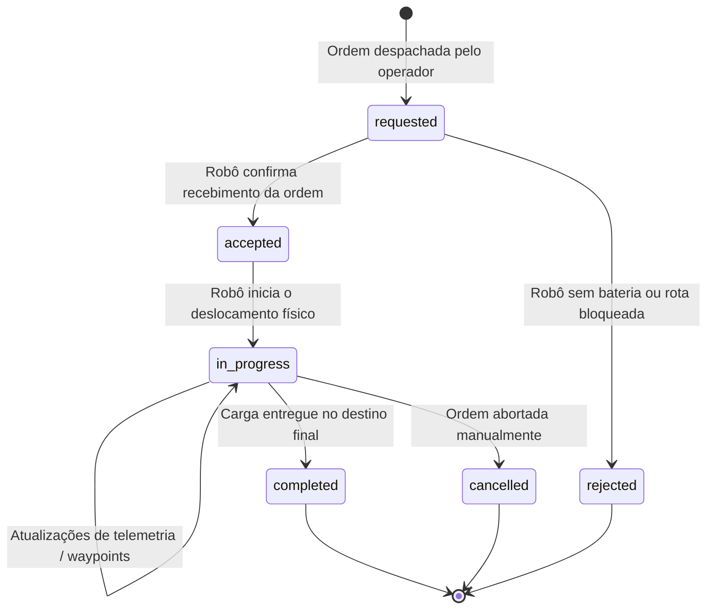

# FHIR Hospital Robotics Simulation Harness
---

##  Overview

O **`harness_mock_api_hosp`** é o orchestrator projetado para gerenciar, sincronizar e executar a API REST e o harness.

---

## Arquitetura do Sistema

O workspace unifica dois microsserviços fundamentais organizados na pasta `modules/`:

1. **[modules/fhir_mock_api](file:///home/socialdroids/repos/harness_mock_api_hosp/modules/fhir_mock_api)**:
   * Servidor mock (FastAPI).
   * Fornece endpoints com especificações FHIR para `Task`, `Device` e `Location`.
2. **[modules/harness_fhir](file:///home/socialdroids/repos/harness_mock_api_hosp/modules/harness_fhir)**:
   * Harness, simulando requisição de tarefas, lista de devices(robôs) e CRUD das tarefas listadas.

---

## Estrutura de Arquivos

```text
.
├── core.repos               # Manifesto vcstool com os repositórios remotos dos submódulos
├── docker-compose.yml       # Orquestrador multi-container (fhir-api + harness)
├── .dockerignore            # Exclusão de arquivos voláteis nas builds do Docker
├── Makefile                 # Interface de linha de comando simplificada para o ciclo de vida
├── modules/                 # Diretório onde os submódulos são importados
└── README.md                # Esta documentação
```

---

## Pré-requisitos

1. **Docker**:
   ```bash
   docker --version
   docker compose version
   ```
2. **`vcstool`**:
   ```bash
   sudo apt-get update && sudo apt-get install -y python3-vcstool

---

## Guia

### 1. Clonar e importar os módulos com `vcstool`
```bash
make repos-import
make repos-sync
> ```

### 2. Construir e inicializar os containers Docker
```bash
make docker-build
make docker-up
```

### 3. Portas de acesso pra cada serviço

* **Harness:** [http://localhost:5173](http://localhost:5173)
* **API FHIR Swagger:** [http://localhost:9123/docs](http://localhost:9123/docs)
* **Endpoint de Healthcheck:** [http://localhost:9123/health](http://localhost:9123/health)

---

## `Makefile`

| Comando | Descrição |
| :--- | :--- |
| `make repos-import` | Lê o `core.repos` e clona os microsserviços para a pasta `modules/`. |
| `make repos-sync` | Exibe o status do Git em todos os módulos e atualiza com `vcs pull`. |
| `make install-deps` | Instala dependências locais (`uv sync` no backend e `pnpm` no frontend). |
| `make docker-build` | Executa o build ou rebuild das imagens do Docker Compose. |
| `make docker-up` | Inicializa os containers em segundo plano (`-d`) com volumes de hot-reload. |
| `make docker-logs` | Acompanha a saída de logs ao vivo de todos os containers (`-f`). |
| `make docker-down` | Encerra os containers e desmonta a rede compartilhada. |

---

## FHIR Task Lifecycle



---

